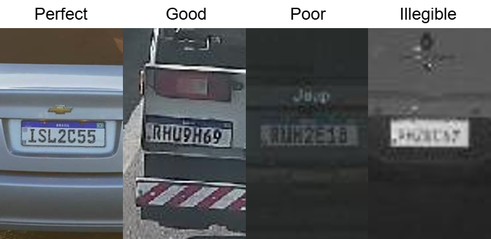
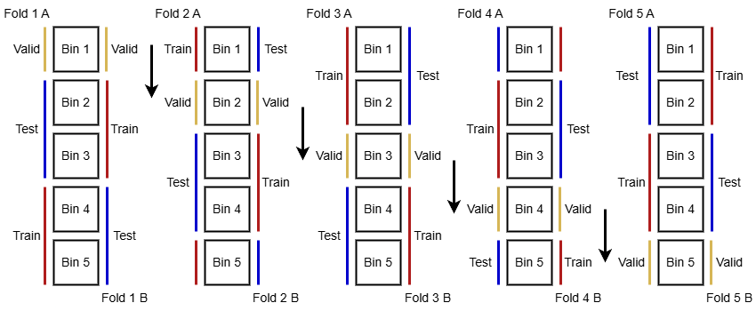

# LPLC Dataset - License Plate Legibility Classification

<p align='center'>

</p>

This is the repository for the LPLC Dataset, presented in the paper "LPLC: A Dataset for License Plate Legibility Classification". This dataset is comprised of 10,200 images, with 12,687 license plates annotated in total. Each license plate is annotated according to readability (4 levels), OCR (for 3 of the 4 readability levels), bounding box (four points (x,y)) and plate and vehicle-wise occlusion (valid vs. occluded attributes). Dataset statistics are available below.

<table border="1px solid black" align='center'>
  <tr>
    <th colspan="2">
        LPs by readability
    </th>
    <th colspan="3">
        Other attributes
    </th>
  </tr>
  <tr>
    <th>
      Class
    </th>
    <th>
      Amount
    </th>
    <th>
      Class
    </th>
    <th>
      True
    </th>
    <th>
      False
    </td>
  </tr>
  <tr>
    <td>
      Perfect
    </td>
    <td align='center'>
      5,535
    </td>
    <td>
      Plate characters not occluded
    </td>
    <td align='center'>
      12,586
    </td>
    <td align='center'>
      101
    </td>
  </tr>
  <tr>
    <td>
      Good
    </td>
    <td align='center'>
      3,426
    </td>
    <td>
      Valid (non-occluded) vehicle
    </td>
    <td align='center'>
      12,389
    </td>
    <td align='center'>
      328
    </td>
  </tr>
  <tr>
    <td>
      Poor
    </td>
    <td align='center'>
      2,122
    </td>
    <td>
      Has OCR
    </td>
    <td align='center'>
      11,083
    </td>
    <td align='center'>
      1604
    </td>
  </tr>
  <tr>
    <td>
      Illegible
    </td>
    <td align='center'>
      1,604
    </td>
    <td>
      Total LPs
    </td>
    <td colspan=2 align='center'>
      12,687
    </td>
  </tr>
</table>

<p align='center'>

</p>

The LPLC dataset is available under request. If you are interested, please contact us (lmlwojcik@inf.ufpr.br or menotti@inf.ufpr.br) in an e-mail titled "2025 LPLC Request Form". Please inform your name, affiliation and purpose of use. Also inform one or two of your recent publications (up to 5 years), if any.

All samples in the dataset can only be used by the applicant and only used for academic research. It may not be used for commercial usage, and use in publications must be properly acknowledged. The BibTeX citation is available below.

```
@article{wojcik2025lplc,
  title = {{LPLC}: A Dataset for License Plate Legibility Classification},
  author = {L. {Wojcik} and G. E. {Lima} and V. {Nascimento} and E. {Nascimento Jr.} and R. {Laroca} and D. {Menotti}},
  year = {2025},
  journal = {Conference on Graphics, Patterns and Images (SIBGRAPI)},
  volume = {},
  number = {},
  pages = {1-6},
  doi = {10.1109/SIBGRAPI67909.2025.11223367},
  issn = {1530-1834},
}
```

## Experiments reproduction

Our results are the average from the test set of a double 5-fold experiment run, where we split the dataset into a 40/20/40 distribution and each fold is used for training twice, alternating the two 40% distributions for training and testing once, resulting in 10 runs. This is illustrated below.

<p align='center'>

</p>

The folds used for each training scenario are available in the dataset. To generate new distributions, use the `gen_splits.py` script. Its usage is illustrated below. This script generates new n-fold distributions (with alternate training/test partitions if the flag `--cross_fold` is enabled, and it defaults to `True`) if the flag `--load_folds` is not provided, defaulting to `False`. Otherwise, the folds are loaded from memory according to the output dir provided in command line (`--output_dir [DIR, optional, default='LPLC_Dataset/folds/']`) or the configuration file.

```
python gen_splits.py \
    --config [CONFIG_FILE] \
    --class_config [SCENARIO_CONFIG, optional] \
    --load_folds [optional]
```

The class configurations correspond to the class mapping used in the experiments presented in our dataset. Our default split generation config, as well as all scenarios configs are available in `configs/`.

Furthermore, this script also prepares the dataset for training by generating a directory of symbolic links with the training/validation/test splits for every fold in a given scenario at `--sldir [DIR, optional, default='sldir']` if the flag `--gen_sym_links` is provided (defaults to `True`). The directory structure is as follows:

```
sldir
├── scen0
|   ├── 0_1
|   │   ├── train
|   |   |   ├── 0
|   |   |   ├── 1
|   |   |   ├── 2
|   |   |   └── 3
|   │   ├── val
|   |   |   ├── 0
|   |   |   ├── 1
|   |   |   ├── 2
|   |   |   └── 3
|   │   └── test
|   |       ├── 0
|   |       ├── 1
|   |       ├── 2
|   |       └── 3
|   ├── 0_2
|   ├── 1_1
|   ├── 1_2
|   ├── 2_1
|   ├── 2_2
|   ├── 3_1
|   └── 3_2
├── scen1
├── scen2
└── scen3
```

### Model training and testing

To train a model in a given run, the basic usage is:

```
python main.py \
    -c  [CONFIG_FILE] \
    -n  [RUN_NAME] \
    -dt [CLASS_CONFIG] \
    -f  [FOLD] \
    
    -t  [TRAIN_CONFIG, optional] \
    -v  [TEST_CONFIG, optional] \
    -p  [DO_PREDICT, optional] \
    -pt [PREDICT_PARTITION, optional] \

    -d  [DEVICE, optional] \
    -bs [BATCH_SIZE, optional] \
    -m  [LOAD_MODEL, optional]
```


The class config argument must correspond to one of the class configs available in `configs/split_configs/`, while fold must correspond to one of the fold dirs generated by `gen_splits.py` (e.g. `-dt configs/split_configs/config_classes_base.json/ -f 0_1`). The load_model flag is used for picking up a half-trained model. All training and testing arguments should be supplied by the configuration file. Our default configs are found in `configs/`, for `yolo`, `vit` and `resnet`. By default, we employ an early stopping strategy.

An example for reproducing our experiments can be found in `scripts/run_experiments.sh`.

### Generating graphs

The training script generates logs, result files and confusion matrices automatically. To generate further graphs from these, use `gen_graphs.py`. We separate the confusion matrix from the training curves (`graphs` vs. `cm` in `configs/config_graph.json`). We use the bokeh library, and either the chrome or firefox webdriver must be installed and linked to python in order for the graphs to be saved to disk as images automatically. Otherwise, they can be saved manually from the html file. For details on how to install bokeh properly, please refer to their [docs](https://docs.bokeh.org/en/2.4.3/docs/user_guide/export.html).

Basic usage (log files are for training curves, results files are for confusion matrices):

```
python gen_graphs.py \
    -c [CONFIG_FILE, default='configs/config_graph.json'] \
    -l [LOG_FILE, optional] \
    -r [RESULTS_FILE, optional]
```
